# Multiversal Manager

[](https://github.com/LightInUmbra/multiversal-manager/actions/workflows/tests.yml)

**Your Magic: The Gathering collection, what it's worth, and the whole card market, all in one place.**

Moxfield, Manabox, and Archidekt are all amazing tools that have shaped the way we view card prices, kept track of our collections and our decks. They do so much, but you know what they don't have (or don't have much of)? Interconnectivity. That's why I developed this: The Multiversal Manager! It's supposed to be a tool like those three, except by offering more! It offers a deck builder, finance/market tracker, and more features to come! The biggest thing of it all though? The convenience. Moxfield and Archidekt are available on the web, which is great when working on a computer; it makes a difference for mobile users though. ManaBox exists, but when you'd like to edit something, it HAS to be done via the app; not even the link can save you. That's where my tool comes in - It bridges that gap so not only do you have access to your collection and price tracking system at anytime, but you have it in your pocket, at home, and anywhere you can access a computer!

It's a desktop app and an Android app that share one collection, with a website at [multiversalmanager.app](https://multiversalmanager.app) that runs the same app in your browser (more on that in [The Multiverse](#the-multiverse)).

Everything it recommends is worked out from the cards themselves (their rules text, official rulings and what they do together), never from play-count sites like EDHREC.

---

## What it does

### Your collection

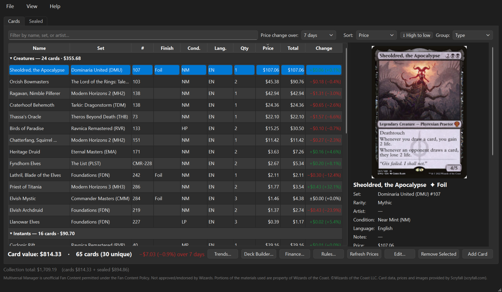

- **Exact printings, not just card names --** Add cards and their printings into your collection! From there, the possibilities are endless! Use the cards you own for the decks you'd like to build, or search through the MTG card database for cards you'd need but don't own (yet!).
- **Condition, language and notes --** The program also picks up on the conditions of cards, their language, and any notes you'd like to put down for them ("signed" or "in the red binder"). If you have the same printing in two conditions or languages, each gets its own entry. Importing decks or cards/card lists pick these up from other tools' CSV files too.
- **Live value --** A running total of what your collection is worth, plus card counts and how each card's price has moved over the last 24 hours, 7, 30 or 90 days, or all time. (Limited by the current app/market data)
- **Price history for every card --** All cards have their price history backdated 3 months; Only real market changes count as movement, so adding or removing cards never looks like a gain or a loss.
- **Trends** (Ctrl+T) -- How your collection's value has changed over time, along with your biggest winners and losers. On the website it's a tab on the Cards page, and on the phone you tap your collection's total.
- **Sort and group it your way --** Sort by name, price, quantity, mana value, color, type, rarity, set or date added, either way around, and group cards by type, color, mana value, rarity, set, finish or condition. Each group shows how many cards it has and what they're worth, and folds away with a click. It works the same in the desktop app, on the website and on the phone, for your collection, your decks, binders and wishlists, and your sealed product, and each list remembers how you left it.
- **Scan cards with your phone --** Point the camera at a card and the app reads its name, set and collector number to find the exact printing. It runs on the phone itself, with no internet needed to read the card. Add it to your collection, or open a deck and scan straight into it.
- **Bring your collection with you --** Import CSV exports from Moxfield, ManaBox, Deckbox and most other tools (columns are matched by their headers), or paste a text file/doc like `4 Lightning Bolt` or `1x Sol Ring (C21) 263 *F*`. You get to review everything before it's saved, and any card where the printing is a guess shows up first, with a picture to help you pick the right one.
- **Export** to CSV whenever you like.
- **Sealed product --** The *Sealed* tab (on the desktop, the website and the phone) keeps track of booster boxes, bundles, precons, prerelease kits and anything else still in shrinkwrap. Pick from MTGJSON's list of every sealed product ever made (search by name or set, filter by type), or type in anything that isn't listed. Each entry keeps what you paid and what it's worth now (you enter both for now; right-click to look it up on TCGplayer), and the bottom of the window shows your cards, your sealed product and the two combined.
- **Quick edits --** Right-click or double-click a card to change its printing, finish, quantity or price. Adding a printing you already own just bumps the quantity instead of making a duplicate.
- **Automatic backups --** The app backs up your collection once a day when it starts and keeps the last 10. Want one right now? *File → Back Up Now*. Need to go back? *File → Restore from Backup…* rolls you back, and saves your current collection first so you can undo the restore too. Backups stay small (a few MB up to tens of MB) because they skip price history that can just be downloaded again.

### Deck Builder

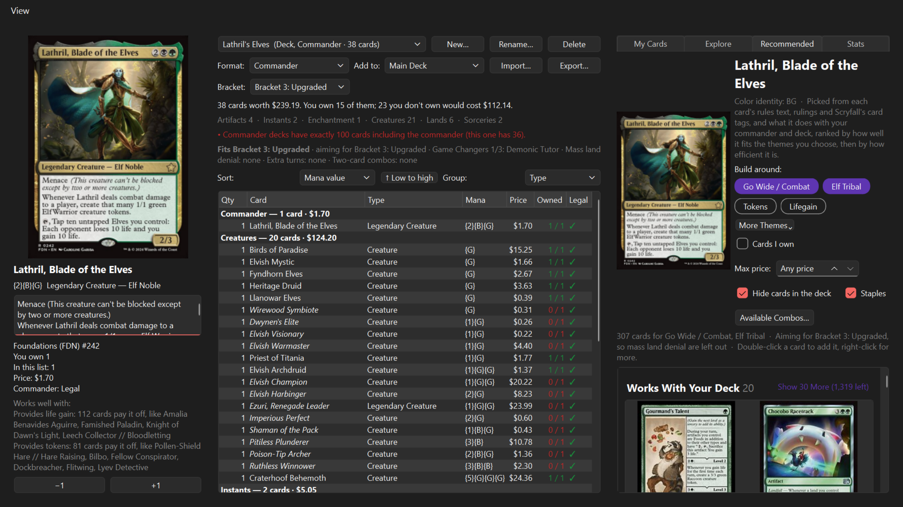

Open it with Ctrl+L. It works for Standard, Pioneer, Modern, Legacy, Vintage, Pauper, Commander, Oathbreaker, Brawl and every other format Scryfall tracks, and you can make binders and wishlists there too.

- **Three panels --** The selected card's details (rules text, legality, how many you own, and −1 / +1 buttons), your deck grouped by section (or by type, color, mana value, rarity or set, sorted however you like), and a grid of card images to build from, each showing how many copies you own.
- **Stats --** The *Stats* tab shows a deck's mana curve and average mana value, its colors by mana symbols, how many of each card type (and the share of lands), and its most valuable cards. It's there in the desktop app, on the website and on the phone (the chart button on a deck).
- **Build from what you have, or explore all of what MTG has to offer --** *My Cards* shows your collection, *Explore* shows every card in Magic: The Gathering. Search, filter by type, color, or "legal for this deck", and sort however you like.
- **Pick your printing --** Choosing a different printing opens a window with every version of the card: its image, set, rarity, and the price of each finish, plus how many you own.
- **Recommendations for your commander --** The *Recommended* tab works on its own using card rules and interaction logic! Put a commander in a Commander deck and the app suggests directions to take it (Elf Tribal, +1/+1 Counters, Spellslinger and so on). Pick one or more and you'll get a list of cards that interact with your commander. Cards already in the deck? You can filter them out! Each card is captioned with why, like "Makes tokens for Rhys the Redeemed" or has notes like "High Synergy Cards". When you're online, *Available Combos…* opens every combo with your commander in its colors from [Commander Spellbook](https://commanderspellbook.com), the ones you're closest to finishing first: each shows its cards (✓ already in the deck, • in your collection), what it does, the lowest bracket that allows it, and how it goes. It even has a section for staples (ramp, card draw, removal, board wipes) if you choose to keep them visible, then creatures, instants and every other card type. It's worked out from each card's rules text, its official rulings (on the website too, from the app's own data) and Scryfall's community card tags; among cards that fit equally well, the cheaper one comes first, and for lands the one making more of your commander's colors. It works offline too. You can limit it to cards you own, set a price cap, and hide what's already in the deck. Give the deck a target bracket and it leaves out the cards that don't fit (Game Changers in Brackets 1–2, a fourth one in Bracket 3, mass land denial below Bracket 4), and Game Changers are marked. Recommendations are for Commander-style decks (Commander, Brawl, Oathbreaker, etc.); other formats don't get them.
- **Commander Brackets --** Commander decks show which of Wizards' brackets (1/Exhibition to 5/cEDH) their cards fit, with their Game Changers, mass land denial, extra-turn cards and two-card infinite combos listed. Pick the bracket you're aiming for next to the format and anything that breaks it is marked in red. Game Changers come from Scryfall's card data and work offline; combos come from [Commander Spellbook](https://commanderspellbook.com) when you're online.
- **What works together --** Select any card, in your collection or the Deck Builder, and its details list what it works well with: the cards its official rulings name, and what it provides or pays off (tokens, +1/+1 counters, creatures dying, a full graveyard, life gain, card draw, instants and sorceries, artifacts, enchantments, lands entering, enters abilities, Auras and Equipment) with a few cards on the other side. The app works this out itself from every card's rules text and rulings; see [interactions.py](interactions.py).
- **Legality checks as you go --** Deck and sideboard size, copy limits (with exceptions for basic lands and "any number" cards), banned and restricted cards, and commander eligibility and color identity are all checked while you build.
- **Know what's missing --** Cards you don't own are marked, and every list shows what it's worth and what the missing cards would cost you.
- **Import and Export --** Deck lists from Arena, Moxfield and most other tools import fine, and export from the app/software as a CSV file.
- **Lightweight mode --** On a slower computer or connection? *View → Lightweight* swaps the images for a plain table that doesn't download any pictures.

The card database (about 80 MB from Scryfall) downloads once and then refreshes weekly.

### Finance

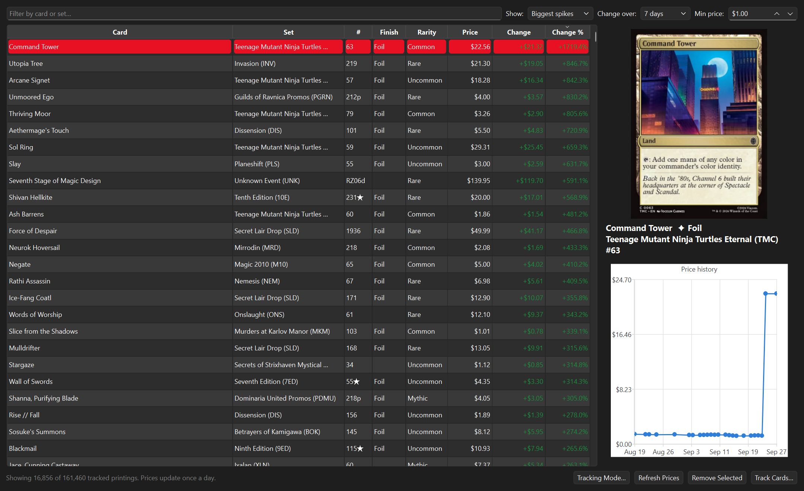

Your window into the wider Magic: The Gathering market (Ctrl+Shift+F).

- **Spikes and drops --** The biggest movers over any time period, for every printing and finish (non-foil, foil, etched). A minimum-price filter keeps penny cards from cluttering things up.
- **Two ways to start --** *Track Every Card* follows all ~160,000 paper printings and finishes and picks up new ones as they come out. *Start Empty* tracks nothing until you tell it to. Either way the full card database gets loaded, so switching later is instant.
- **Track what you care about --** Add a single printing, every printing of a card, or entire sets with *Track Cards…*. Remove a printing or a whole set with Delete or a right-click. Price history sticks around either way.
- **History from day one --** The first launch grabs 90 days of price history for every card, so you get trends right away. After that the app saves each day's prices and the history just keeps growing.

On the website and the phone, Finance works from a market file that GitHub builds once a day: every printing's price today and over the last 90 days, a few MB instead of hundreds. Tap a card on the phone for its enlarged image, its price over every period, its history and how many you own.

> Heads up: the first time you open Finance on the desktop it downloads about 140 MB (card data plus 90 days of prices), and the database grows to a few hundred MB. Prices update once a day, as often as the data sources publish them.

### Rules

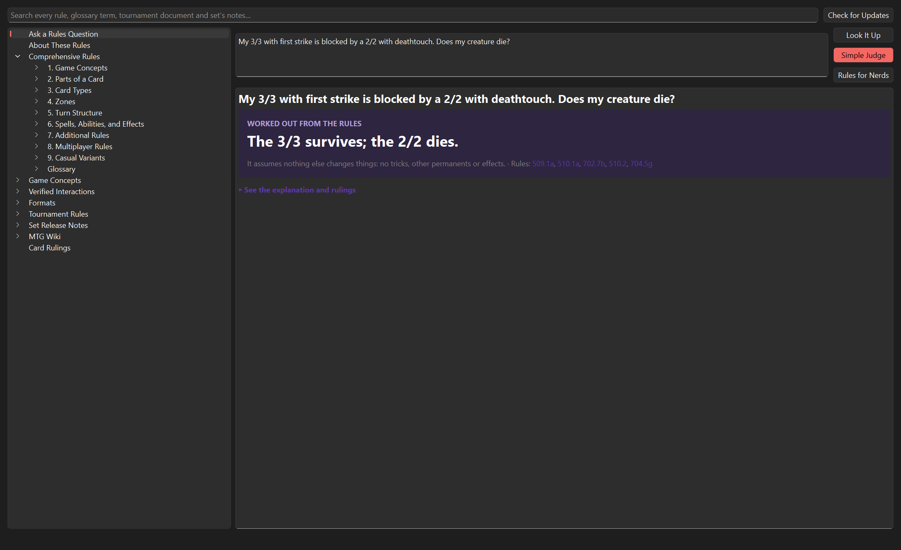

Every official rulebook in one place (Ctrl+R), kept on your computer so it works offline.

- **Comprehensive Rules --** All ~3,100 rules, browsable by section and chapter, plus the glossary. Rule numbers anywhere ("see rule 702.19") are links.
- **Formats --** Deck rules and the current banned list for every format, plus the full rules for Commander (from the Commander Format Panel), Brawl and Oathbreaker, the Commander Brackets (every bracket's intent and limits, what the terms mean, the current Game Changers list and the history of changes), and the casual variants like Two-Headed Giant and Planechase.
- **Tournament rules --** The Magic Tournament Rules, the Infraction Procedure Guide and Judging at Regular REL, split into their sections.
- **Ask a rules question --** Type a question in plain English ("I attack with a first striker and have a ninjutsu creature in hand, does the Ninja deal damage?") and get the verified rulings that match it, plain-English guides to the game concepts involved, the cards you mention with their rulings, and the exact rules that govern it. Combat (who can block, what dies, how much damage), timing (can I cast this now?) state questions (does it die, does a player lose, the legend rule), Commander Brackets (is this a Game Changer, what bracket can I play it in) and token counts (every Doubling Season, Chatterfang and Ojer Taq on the battlefield, applied in the best order) are worked out from the rules step by step, and "How does haste work?" gets the keyword's definition and rules. No AI and no internet needed.
- **Game Concepts --** Plain-English guides to the systems behind most interactions: priority and the stack, APNAP order, combat and first strike, state-based actions, layers and timestamps, replacement effects, triggers, zone changes, copies, commander rules and more, each linked to the official rules.
- **Verified interactions --** A growing library of checked rulings for common and tricky interactions, each with the rules that settle it.
- **Set release notes --** Every set's release notes from Wizards back to 2013, and the set FAQs before that back to Ice Age (from Wizards' old site, via the Internet Archive): each set's mechanics and its card-by-card clarifications.
- **MTG Wiki --** The fan wiki's pages on every mechanic and every set, credited under CC BY-NC-SA 4.0. Ask shows the summary of any mechanic in your question.
- **Card rulings --** Look up any card for its official rulings and the rules for its keywords. Add a few cards to see them side by side, with the keywords and rules terms they share.
- **Search --** One box searches all of it.

New versions are checked for once a week. Everything comes straight from Wizards of the Coast (and Scryfall for card rulings), so it's as current as the official documents.

<details>
<summary><b>More screenshots</b></summary>

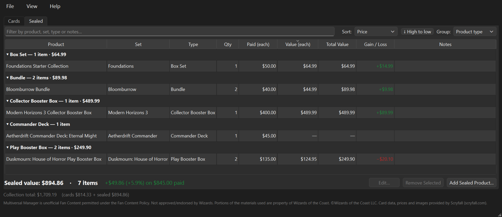

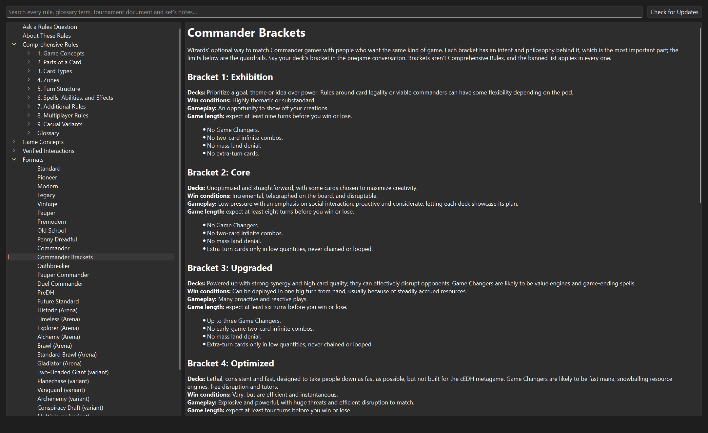

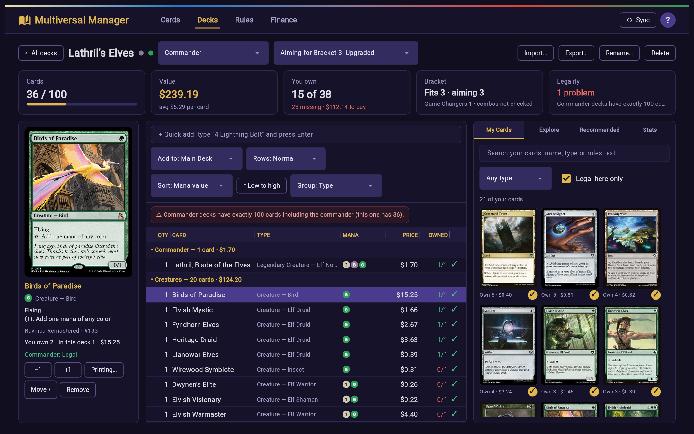

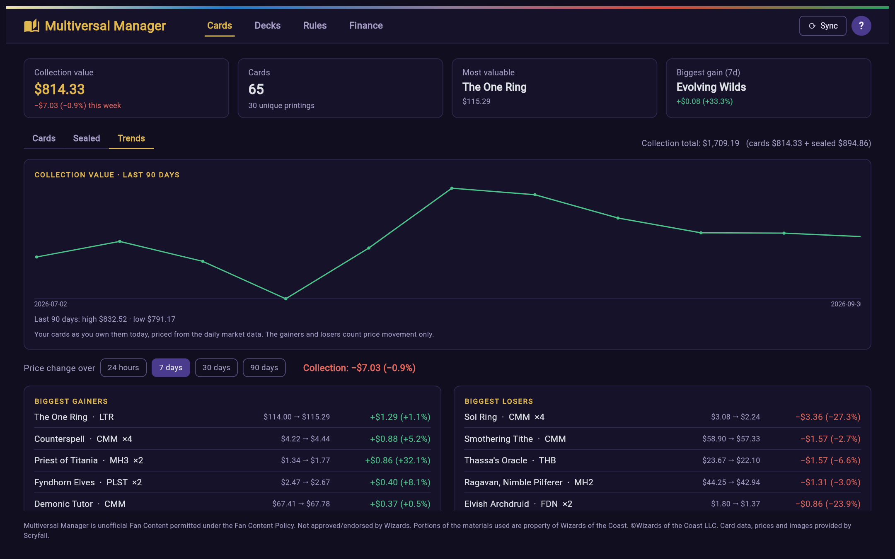

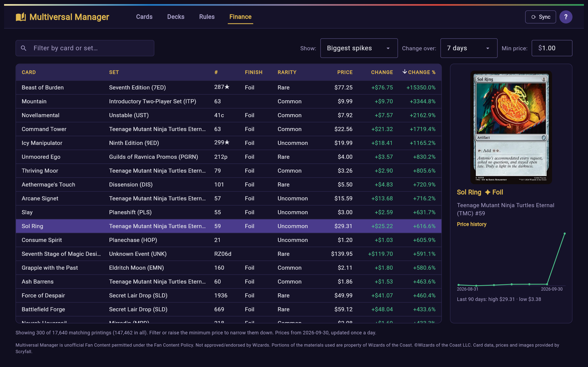

</details>

---

## The Multiverse

The bigger idea is a set of connected apps that all share the same collection:

| Platform | Status |
|---|---|
| **Desktop** | Available! |
| **Android** | Available; collection and prices, sealed product, Trends, Finance, importing, Deck Builder (with Stats, and Recommended and Available Combos for Commander decks), the rules judge, and a camera card scanner that adds to your collection or straight into a deck |
| **Web** | [multiversalmanager.app](https://multiversalmanager.app), updated with every release; the desktop's layout in your browser (collection, sealed product, Trends, Finance, importing, Deck Builder with Commander recommendations, rules), signed in to the same account. Prefer the phone's layout? Switch to it from the account menu |

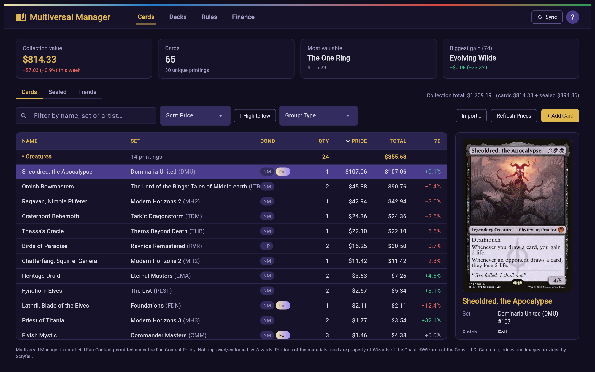

<p align="center">
  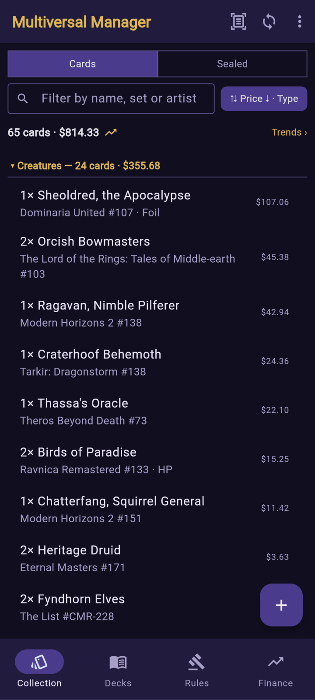
  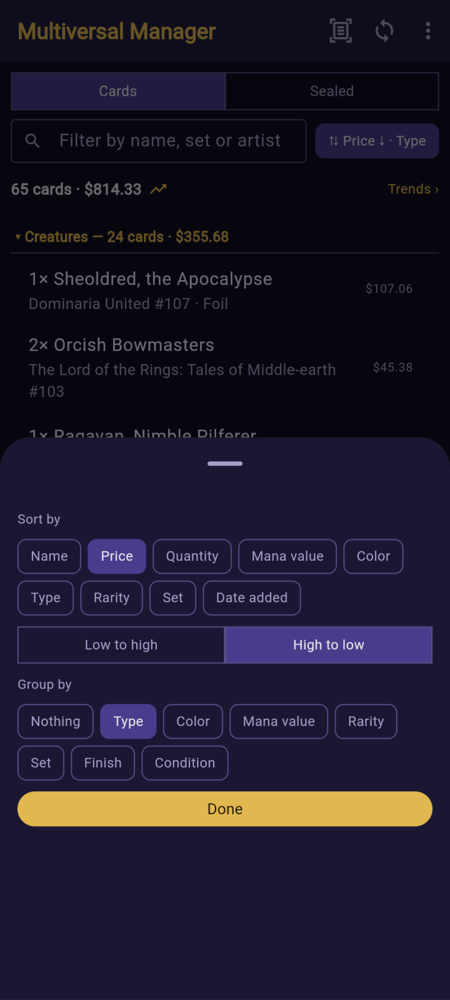
  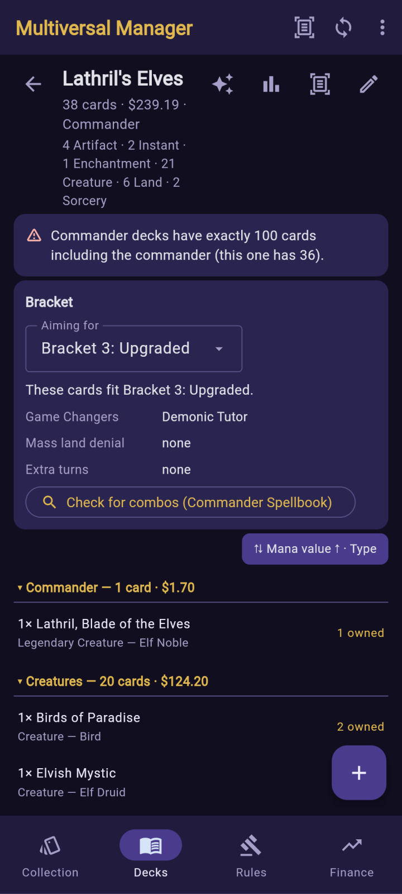
  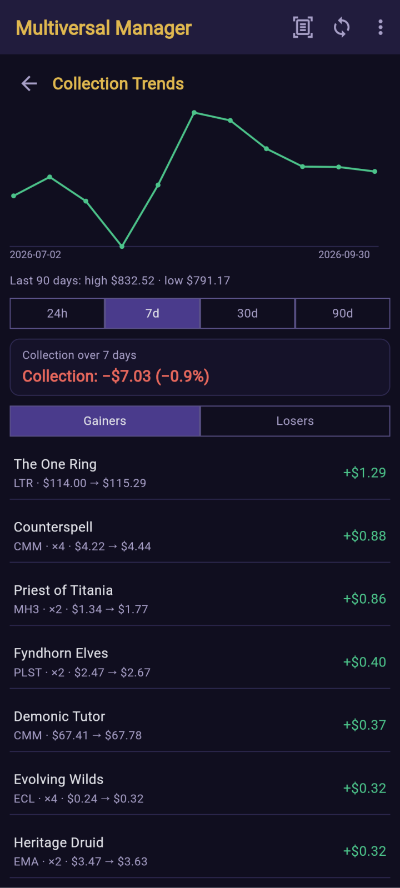
  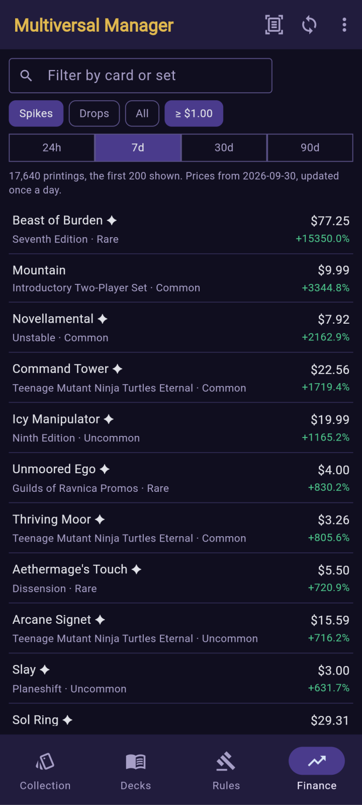
</p>

The goal: add a card on your phone while you're at the store, and it's already there on your desktop when you get home. Sign in under *File → Sync Account* on the desktop (the person icon on the phone) with the same account on each, and your cards, decks and sealed product sync on their own within a few seconds. Each device keeps its own copy in a local SQLite database, so everything still works offline and catches up the next time it's online.

---

## Getting started

### Windows: download and run

There are two versions on the [Releases page](https://github.com/LightInUmbra/multiversal-manager/releases), same app either way:

- **Installer** (`Multiversal-Manager-<version>-setup.exe`): installs for your Windows user, no admin rights needed, with a Start menu entry, an optional desktop shortcut and an uninstaller. Your collection lives in `%LOCALAPPDATA%\Multiversal Manager`, and uninstalling never deletes it.
- **Portable** (`Multiversal-Manager-<version>-portable.zip`): unzip it anywhere, a USB stick included, and run `Multiversal Manager.exe`. Your collection, settings and backups stay in that folder, so you can carry it between computers. (That's what the `Portable Mode.txt` next to the .exe does; delete it and the portable copy uses your user folder like the installed one.)

Moving an existing collection over? Use *Back Up Now* in the old copy, then *Restore from Backup* in the new one.

### Android: download and install

Download `Multiversal-Manager-<version>.apk` from the [Releases page](https://github.com/LightInUmbra/multiversal-manager/releases) on your phone and open it. Android asks you to allow installs from your browser or file manager the first time, and may warn that the app isn't from the Play Store. Later versions install over it as updates. It runs on 64-bit phones (nearly every phone from the last several years). Sign in with your sync account and your collection comes across.

### From source

Multiversal Manager uses [Magic-Projects](https://github.com/LightInUmbra/Magic-Projects), a Scryfall toolkit I also wrote, as a git submodule. So clone it with submodules:

```
git clone --recurse-submodules https://github.com/LightInUmbra/multiversal-manager.git
cd multiversal-manager
```

(Already cloned without them? No problem, just run `git submodule update --init`.)

Then set up a virtual environment, install the dependencies, and launch:

```
python -m venv .venv
.venv\Scripts\activate          # Windows
source .venv/bin/activate       # macOS / Linux
pip install -r requirements.txt
python main.py
```

Your data never leaves your machine. Run from source, your collection and price history live in `collection.db` next to `main.py`, settings go in `settings.ini`, backups go in `backups/`, the rules documents in `rules/`, and card images are cached in `image_cache/`. All of it is git-ignored.

### Taking it offline

Everything lives in that one folder, so you can copy it to a USB stick or another computer and pick up right where you left off. No internet where you're going? Turn on *File → Work Offline*. Adding, editing and importing cards then run entirely off the downloaded card data, using the prices from its last update, and you'll only see card images you've already viewed. Just open the Deck Builder or Finance once while you're online first, so the card data is there to work from.

### Running the tests

```
python -m pytest
```

### Building the Windows app

```
python build.py
```

This makes both versions in `dist/`: the portable zip and, if [Inno Setup 6](https://jrsoftware.org/isinfo.php) is installed (`winget install JRSoftware.InnoSetup`), the installer. The version number is `VERSION` in `build.py`.

### Building the website

```
python mobile/build_web.py
python -m http.server -d mobile/build/web
```

The first line builds a static site in `mobile/build/web` (the phone app built with `flet build web`, so its Python runs in the browser and needs no server); the second serves it at http://localhost:8000 to try. The website keeps no collection between visits: signing in brings yours over from sync. It does come with the rules: browsers can't download them from Wizards of the Coast, so the build copies in the ones the desktop app downloaded (open its Rules window once first), set notes and MTG Wiki pages included; card rulings and banned lists come live from Scryfall. Set `BASE_URL` to the folder it's served from (e.g. `multiversal-manager` for GitHub Pages) before building.

### Updating which cards work together

```
python interactions.py build
```

Rebuilds `interactions.json.gz` from the card database and rulings on your computer (open the Deck Builder and the Rules window once so both are downloaded). It takes about half a minute. Every release does this for you: it downloads Scryfall's newest card data and rulings and rebuilds the file before building the apps (`python interactions.py build --download`, which uses a throwaway database and never touches your collection), so committing the file is only needed to try new data before a release. Cards newer than the file still pair up by their rules text.

### The website's market data

The website and the phone can't download the whole card market like the desktop does, so `.github/workflows/market.yml` builds a small summary of it once a day on GitHub (`python market.py market.json.gz`) and publishes it on the `market-data` branch, where Finance and Trends read it. It runs on its own; to start it by hand, use *Run workflow* on the Actions tab.

### Releasing a new version

Tests run on GitHub for every push (the badge at the top). To publish a version, tag it and push the tag:

```
git tag v1.0.0
git push origin v1.0.0
```

GitHub then runs the tests, builds the installer and the portable zip on Windows, and publishes both on the [Releases page](https://github.com/LightInUmbra/multiversal-manager/releases), with notes listing what changed since the last release. Then it builds the Android app and adds its APK to the same release, and builds the website (downloading the newest rules for it first) and publishes it on GitHub Pages at [multiversalmanager.app](https://multiversalmanager.app). The tag sets the version number, so `v1.2.0` makes `Multiversal-Manager-1.2.0-setup.exe` and `Multiversal-Manager-1.2.0.apk`.

The Android app is signed with a release key that isn't in the repository. To build it yourself, run `python mobile/build_apk.py` (see the top of that file); without the key your APK gets your computer's own debug key, which can't update a copy installed from the Releases page.

---

## Under the hood

For the curious, here's how things are laid out:

```
multiversal-manager/
    main.py                  # Main window: collection table, card details, totals
    finance.py               # Finance window: market tracking, spikes and drops, daily updates
    sealed.py                # Sealed tab: booster boxes, bundles and other sealed product
    rules.py                 # Downloads and reads the official rules documents and card rulings
    set_notes.py             # Every set's release notes and FAQs, and MTG Wiki's mechanic and set pages
    judge.py                 # Rules calculators: combat, timing and state checks, worked out from the rules
    rules_window.py          # Rules window: browse, search, ask a question, look up card rulings
    rules_library.json       # Game Concepts guides and verified interactions (shared data)
    lists.py                 # Deck Builder: decks, binders and wishlists
    recommendations.py       # Deck Builder's Recommended tab
    synergy.py               # Commander themes and how recommendations are picked (card text, rulings, tags)
    interactions.py          # Which cards work together: ruling links and what each card provides / pays off
    interactions.json.gz     # Its data, built from every card and ruling (shared by every app), and the
                             # themes each card's rulings match, so the website's recommendations use rulings too
    deck_stats.py            # A deck's numbers, shared by every app: owned copies, totals, mana curve
    card_browser.py          # Card image grid / lightweight table, and the printing picker
    formats.py               # Formats and deck legality rules
    build.py                 # Builds the Windows app: portable zip and installer (installer.iss)
    brackets.py              # Commander Brackets: the brackets, Game Changers, and checking a deck
    price_changes.py         # How prices moved over a period, shared by every app
    market.py                # The daily market summary behind Finance and Trends on the website and phone
    card_sorting.py          # Sorting and grouping cards, the same in every app
    sort_bar.py              # The desktop's Sort / Group controls and group headings
    trends.py                # The Trends window
    database.py              # SQLite storage, price history and schema upgrades
    backup.py                # Daily backups, Back Up Now and Restore
    importer.py              # CSV / text list parsing and printing matching
    copy_details.py          # Conditions and languages, and reading them from other tools
    import_review_dialog.py  # Review step for imports
    add_card_dialog.py       # Add / Edit Card with live name suggestions
    printing_picker.py       # Printing, finish and price picker with card preview
    card_image.py            # Card images, loaded in the background and never cropped
    charts.py                # Price and value history charts
    scryfall.py              # Card data, prices, images and bulk downloads
    mtgjson.py               # 90-day price history backfill and the list of sealed products
    background.py            # Keeps network work off the interface thread
    sync.py                  # Syncing with the other devices (Supabase), merging edits made on both
    ask.py                   # The rules judge's Ask a Rules Question, shared with the phone app
    card_scan.py             # Recognizing a card from the text read off a photo of it
    supabase/schema.sql      # The sync database's table and security rules
    mobile/                  # The Android app and the website (Flet), reusing the modules above
        main.py              # Collection, sync and the tabs; picks the phone or desktop layout
        decks.py             # Deck Builder (phone)
        rules_tab.py         # Rules: ask, search and browse
        scan.py              # The camera card scanner
        card_reader/         # Flet extension: reads text on the phone with Google ML Kit
        web_desktop.py       # The website's desktop layout: header, dashboard tiles, collection table
        web_decks.py         # The website's Deck Builder, in the desktop's three-panel layout
        web_rules.py         # The website's Rules page, laid out like the desktop's Rules window
        web_finance.py       # The website's Finance page
        web_sealed.py        # The website's Sealed tab
        web_trends.py        # Trends, for the website and the phone
        web_import.py        # Importing on the website, with the desktop's review step
        phone_finance.py     # Finance on the phone
        phone_sealed.py      # Sealed product on the phone
        phone_import.py      # Importing on the phone
        sort_controls.py     # Sort / Group controls for the website and the phone
        card_form.py         # The website's Add / Edit Card window
        theme.py             # Colors, fonts and shared controls for the phone and website
        build_apk.py         # Builds the APK
        build_web.py         # Builds the website
    external/
        Magic-Projects/      # Submodule: the ScryFunctions toolkit and Card class
    tests/
```

**Built with** Python 3, PySide6 (Qt for Python), QtCharts and SQLite on the desktop; [Flet](https://flet.dev) and Google ML Kit text recognition on Android; [Supabase](https://supabase.com) for sync.

---

## Credits and legal

Card data, images and daily prices come from [Scryfall](https://scryfall.com), and historical prices come from [MTGJSON](https://mtgjson.com). Two-card combos for the Commander Brackets check come from [Commander Spellbook](https://commanderspellbook.com). A huge thank you to both for making this data freely available; this app wouldn't exist without them. Card images are always shown in full so the artist credit and copyright line stay visible. Prices are market estimates, so please don't treat them as gospel.

Multiversal Manager is unofficial Fan Content permitted under the [Fan Content Policy](https://company.wizards.com/en/legal/fancontentpolicy). Not approved/endorsed by Wizards. Portions of the materials used are property of Wizards of the Coast. ©Wizards of the Coast LLC.
